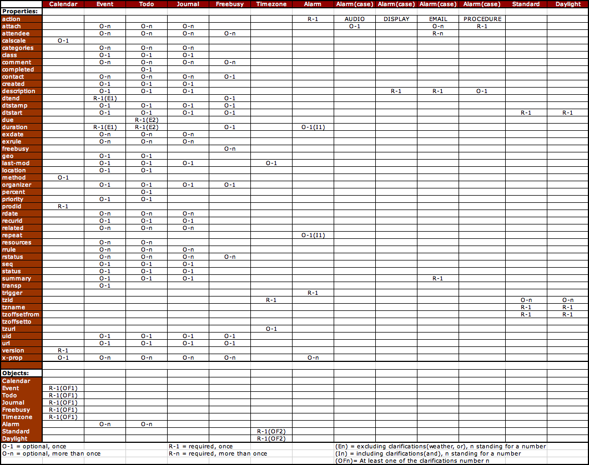

# API-reference для приложения-календаря

TODO: request examples<br />

Работа с API организована с помощью HTTP-запросов <br />
Используемые методы: GET, POST, PATCH, DELETE <br />
Content-Type: application/json и application/x-www-form-urlencoded <br />
Для генерации документации к API используется [Swagger](http://planner.skillmasters.ga/docs).
Настоятельно рекомендую сверять API с ним, т.к. в нем оно всегда актуально.

----------------------------------------------------------------------------------------------------------------------

### Аутентификация
- Для авторизации используется Firebase Authentication. <br />
0) Сперва необходимо зарегистрировать ваше приложение. Пишем [zeroicq](https://github.com/ZeroICQ).
1) [Установка (Step 3+)](https://firebase.google.com/docs/android/setup)
2) [настройка UI](https://firebase.google.com/docs/auth/android/firebaseui).
3) От Firebase получаем JWT-токен. Его необходимо добавлять в header каждого запроса к API: <br />
`X-Firebase-Auth: <jwt_token>`


### Напоминания

Используют Google Cloud Messaging [GCM]. Для общего понимания можно почитать:

* https://javapapers.com/android/google-cloud-messaging-gcm-for-android-and-push-notifications
* https://code.tutsplus.com/ru/tutorials/how-to-get-started-with-push-notifications-on-android--cms-25870

API GCM на данный момент могло обновиться, поэтому так же стоит посетить:

* https://developers.google.com/cloud-messaging/concept-options?hl=ru


### Календарь и список задач

Для лучшего понимания архитектуры и внесения обоснованных изменений рекомендуется ознакомиться со
[спецификацией iCalendar](https://www.kanzaki.com/docs/ical/).

Для периодических событий используются RRULE и EXRULE правила стандарта iCalendar
([RFC 2445](https://tools.ietf.org/html/rfc2445) / [RFC 5545](https://tools.ietf.org/html/rfc5545)).




**Task** - задача

| Name        | Type                | Description                              |
|-------------|---------------------|------------------------------------------|
| id          | uint, required      | Уникальный ID задачи                     |
| name        | string, optional    | Название задачи                          |
| details     | string, optional    | Описание задачи                          |
| status      | string, optional    | Текущий статус задачи, enum              |
| event_id    | uint, optional      | ID события, за которым закреплена задача |
| parent_id   | uint, optional      | ID родительской задачи                   |
| deadline_at | timestamp, required | Крайний срок выполнения задачи           |
| created_at  | timestamp, optional | Unix-время в мс создания задачи          |
| updated_at  | timestamp, optional | Unix-время в мс обновления задачи        |


**Event** - событие

| Name       | Type                | Description                                                                                     |
|------------|---------------------|-------------------------------------------------------------------------------------------------|
| id         | uint, required      | Уникальный ID события                                                                           |
| owner_id   | string, required    | ID создателя события, в данный момент это полученный от Firebase UID                            |
| name       | string, optional    | Название события                                                                                |
| details    | string, optional    | Описание события                                                                                |
| location   | string, optional    | Место события                                                                                   |
| status     | string, optional    | Статус события                                                                                  |
| started_at | timestamp, optional | Unix-время в мс начала события. Присутствует только при запросе события на временном промежутке |
| ended_at   | timestamp, optional | Unix-время в мс конца события. Присутствует только при запросе события на временном промежутке  |
| created_at | timestamp, optional | Unix-время в мс создания события                                                                |
| updated_at | timestamp, optional | Unix-время в мс обновления события                                                              |


**EventPattern** - описывает RRULE, RDATE, EXRULE и EXDATE правила для события

| Name        | Type                | Description                                                                                       |
|-------------|---------------------|---------------------------------------------------------------------------------------------------|
| id          | uint, required      | Уникальный ID правила                                                                             |
| event_id    | uint, required      | ID события                                                                                        |
| timezone    | string, optional    | Часовой пояс. Необходим для корректной обработки повторяющихся событий                            |
| rrule       | string, optional    | RRULE-строка, описывающая правило повторения события                                              |
| exrules     | ExRule[], optional  | Не реализовано. Набор EXRULE-строк, описывающая исключения для повторяющихся событий              |
| duration    | timestamp, optional | Продолжительность события в мс. В будущем - если NULL, то равна времени, оставшемуся до конца дня |
| started_at  | timestamp, optional | Unix-время в мс начала события / правила                                                          |
| ended_at    | timestamp, optional | Unix-время в мс конца события / правила                                                           |
| created_at  | timestamp, optional | Unix-время в мс создания правила                                                                  |
| updated_at  | timestamp, optional | Unix-время в мс обновления правила                                                                |


**ExRule** - описывает EXRULE правила для события

| Name        | Type                | Description                                                                                       |
|-------------|---------------------|---------------------------------------------------------------------------------------------------|
| id          | uint, required      | Уникальный ID правила                                                                             |
| rule        | string, required    | EXRULE-строк, описывающая исключения для повторяющихся событий                                    |
| created_at  | timestamp, optional | Unix-время в мс создания правила                                                                  |
| updated_at  | timestamp, optional | Unix-время в мс обновления правила                                                                |


**EventInstance** - событие, сгенерированное на основании rrule, exrrules, started_at и ended_at шаблона / паттерна

| Name       | Type                | Description                                                                                        |
|------------|---------------------|----------------------------------------------------------------------------------------------------|
| event_id   | uint, required      | ID события                                                                                         |
| pattern_id | uint, required      | ID шаблона, по которому сгенерирован экземпляр                                                     |
| started_at | timestamp, required | Unix-время в мс начала события. Присутствует только при запросе события на временном промежутке    |
| ended_at   | timestamp, required | Unix-время в мс конца события. Присутствует только при запросе события на временном промежутке     |


**Permission** - право на доступ к сущностям другого пользователя

| Name        | Type                | Description                                                                                       |
|-------------|---------------------|---------------------------------------------------------------------------------------------------|
| id          | uint, required      | Уникальный ID                                                                                     |
| entity_id   | uint, required      | ID сущности. Или пользователя, если необходимо выдать разрешение на все сущности указанного типа  |
| user_id     | uint, required      | ID пользователя, который получил разрешение                                                       |
| owner_id    | uint, required      | ID владельца сущности                                                                             |
| name        | string, required    | Название разрешения. Например, READ_EVENT                                                         |
| created_at  | timestamp, optional | Unix-время в мс создания разрешения                                                               |
| updated_at  | timestamp, optional | Unix-время в мс обновления разрешения                                                             |


### Не реализовано:

**Tag** - теги событий (не реализовано)

| Name       | Type                | Description                              |
|------------|---------------------|------------------------------------------|
| id         | uint, required      | Уникальный ID тега                       |
| name       | string, required    | Название тега                            |
| slug       | string, required    | Уникальное ключевое слово тега, латиница |
| created_at | timestamp, optional | Unix-время в мс создания тега            |
| updated_at | timestamp, optional | Unix-время в мс обновления тега          |


**EventToTag** - m2m связь событий и тегов

**EventToUser** - m2m связь событий и их участников

**TaskToUser** - m2m связь для ответственных за задачу

**TagToUser** - m2m связь тегов и пользователей, подписка на теги


### Права доступа

Все сущности регулируются следующими правами доступа: READ, UPDATE, DELETE. <br />
Типы доступных сущностей: EVENT, PATTERN, TASK. <br />
У владельца сущности всегда есть все права. Для выдачи прав предусмотрены методы:
- `/api/v1/grant`
- `/api/v1/share`
- `/api/v1/share/{token}`

`grant` позволяет немедленно выдать разрешение, если вам известен uid пользователя. <br />
`share` отдает ссылку, по которой должен перейти авторизованный пользователь, чтобы получить переданные вами права. <br />
Вы должны самостоятельно определить, как запрос к ссылке будет организован в вашем приложении.
Например, вы можете сообщить пользователю уникальный токен данной ссылки
и позволить другому пользователю просто ввести его.


### API-методы

`GET /api/v1/events/instances`
> Возвращает коллекцию экземпляров событий, сгенерированных на основании определенных для них паттернов.
> На один паттерн генерируется не более 1000 экземпляров.

**Параметры**

| Field        | Type                | Description                                                                   |
|--------------|---------------------|-------------------------------------------------------------------------------|
| id           | uint[], optional    | Массив из ID событий, которые необходимо рассмотреть                          |
| owner_id     | string, optional    | ID владельца события. Для доступа необходимо право на чтение (READ)           |
| from         | timestamp, optional | Unix-время в мс после которого события закончатся (включительно)              |
| to           | timestamp, optional | Unix-время в мс до которого события могут начаться (включительно)             |
| created_from | timestamp, optional | Unix-время в мс после которого события были созданы (включительно)            |
| created_to   | timestamp, optional | Unix-время в мс до которого события были созданы (включительно)               |
| updated_from | timestamp, optional | Unix-время в мс после которого события были обновлены (включительно)          |
| updated_to   | timestamp, optional | Unix-время в мс до которого события были обновлены (включительно)             |

**HTTP 200**
```
{
   "success": true,
   "status": 200,
   "data": [
      {
         "event_id": "...",
         "pattern_id": "...",
         "started_at": "...",
         "ended_at": "..."
      },
      ...
   ],
   "count": 2,
   "offset": 0
}
```

----------------------------------------------------------------------------------------------------------------------

`GET /api/v1/events`
> Возвращает коллекцию доступных пользователю событий. Поддерживает пагинацию.

**Параметры**

| Field        | Type                | Description                                                                   |
|--------------|---------------------|-------------------------------------------------------------------------------|
| id           | uint[], optional    | Массив из ID событий, которые необходимо рассмотреть                          |
| tags         | string[], optional  | WIP. Теги, которым события принадлежат (дискас - пересечение или объединение) |
| participants | uint[], optional    | WIP. ID участников события                                                    |
| owner_id     | string, optional    | ID владельца события. Для доступа необходимо право на чтение (READ)           |
| count        | uint, optional      | Количество событий, которое необходимо вернуть. По умолчанию: 100             |
| offset       | uint, optinal       | Количество событий, которое необходимо пропустить. По умолчанию: 0            |
| from         | timestamp, optional | Unix-время в мс после которого события закончатся (включительно)              |
| to           | timestamp, optional | Unix-время в мс до которого события могут начаться (включительно)             |
| created_from | timestamp, optional | Unix-время в мс после которого события были созданы (включительно)            |
| created_to   | timestamp, optional | Unix-время в мс до которого события были созданы (включительно)               |
| updated_from | timestamp, optional | Unix-время в мс после которого события были обновлены (включительно)          |
| updated_to   | timestamp, optional | Unix-время в мс до которого события были обновлены (включительно)             |

**HTTP 200**
```
{
   "success": true,
   "status": 200,
   "data": [
      {
         "id": "...",
         "owner_id": "...",
         "name": "...",
         "details": "...",
         "status": "...",
         "location": "...",
         "started_at": "...",
         "ended_at": "...",
         "created_at": "...",
         "updated_at": "..."
      },
      ...
   ],
   "count": 2,
   "offset": 0
}
```

----------------------------------------------------------------------------------------------------------------------


`POST /api/v1/events`
> Создание нового события.

**Параметры**

| Field        | Type                     | Description                                                         |
|--------------|--------------------------|---------------------------------------------------------------------|
| name         | string, optional         | Название события                                                    |
| details      | string, optional         | Описание события                                                    |
| location     | string, optional         | Место события                                                       |
| status       | string, optional         | Статус события                                                      |
| tags         | Tag[], optional          | WIP. Теги события. В случае, если тег отсутствует - он будет создан |
| participants | uint[], optional         | WIP. ID участников события                                          |

**HTTP 200**
```
{
   "success": true,
   "status": 200,
   "data": [
      {
         "id": 1,
         ...
      }
   ],
   "count": 1
}
```

----------------------------------------------------------------------------------------------------------------------


`PATCH /api/v1/events/{id}`
> Частичное обновление события. `id` события передается в URL запроса.

**Параметры**

| Field        | Type                     | Description                                                         |
|--------------|--------------------------|---------------------------------------------------------------------|
| name         | string, optional         | Название события                                                    |
| details      | string, optional         | Описание события                                                    |
| location     | string, optional         | Место события                                                       |
| status       | string, optional         | Статус события                                                      |

**HTTP 200**
```
{
   "success": true,
   "status": 200,
   "data": [
      {
         "id": 1,
         ...
      }
   ],
   "count": 1
}
```

----------------------------------------------------------------------------------------------------------------------


`DELETE /api/v1/events/{id}`
> Удаление события. `id` события передается в URL запроса.

**HTTP 200**
```
{
   "success": true,
   "status": 200,
   "message": "ok"
}
```

----------------------------------------------------------------------------------------------------------------------


`GET /api/v1/patterns`
> Возвращает коллекцию доступных паттернов. Поддерживает пагинацию.

**Параметры**

| Field        | Type                | Description                                                                   |
|--------------|---------------------|-------------------------------------------------------------------------------|
| id           | uint[], optional    | Массив из ID паттернов, которые необходимо вернуть                            |
| events       | uint[], optional    | Массив из ID событий, для которых необходимо вернуть паттерны                 |
| count        | uint, optional      | Количество паттернов, которое необходимо вернуть. По умолчанию: 100           |
| offset       | uint, optinal       | Количество паттернов, которое необходимо пропустить. По умолчанию: 0          |
| from         | timestamp, optional | Unix-время в мс после которого паттерны закончатся (включительно)             |
| to           | timestamp, optional | Unix-время в мс до которого паттерны могут начаться (включительно)            |
| created_from | timestamp, optional | Unix-время в мс после которого паттерны были созданы (включительно)           |
| created_to   | timestamp, optional | Unix-время в мс до которого паттерны были созданы (включительно)              |
| updated_from | timestamp, optional | Unix-время в мс после которого паттерны были обновлены (включительно)         |
| updated_to   | timestamp, optional | Unix-время в мс до которого паттерны были обновлены (включительно)            |

**HTTP 200**
```
{
   "success": true,
   "status": 200,
   "data": [
      {
         "id": "...",
         "rrule": "...",
         "exrules": [ ... ],
         "timezone": "...",
         "duration": "...",
         "started_at": "...",
         "ended_at": "...",
         "created_at": "...",
         "updated_at": "..."
      },
      ...
   ],
   "count": 2,
   "offset": 0
}
```

----------------------------------------------------------------------------------------------------------------------


`POST /api/v1/patterns`
> Создание нового паттерна.

**Параметры**

| Field      | Type                | Description                                                                      |
|------------|---------------------|----------------------------------------------------------------------------------|
| event_id   | uint, required      | GET-параметр. ID события для которого создается паттерн                          |
| timezone   | string, optional    | Часовой пояс. Необходим для корректной обработки повторяющихся событий           |
| rrule      | string, optional    | RRULE-строка, описывающая правило повторения события                             |
| exrules    | ExRule[], optional  | Не реализовано. EXRULE объекты, описывающие исключения для повторяющихся событий |
| duration   | uint, optional      | Продолжительность события в мс                                                   |
| started_at | timestamp, optional | Unix-время в мс начала события / правила                                         |
| ended_at   | timestamp, optional | Unix-время в мс конца события / правила                                          |

**HTTP 200**
```
{
   "success": true,
   "status": 200,
   "data": [
      {
         "id": "...",
         "rrule": "...",
         "exrules": [ ... ],
         "duration": "...",
         "started_at": "...",
         "ended_at": "...",
         "created_at": "...",
         "updated_at": "..."
      }
   ],
   "count": 1
}
```

----------------------------------------------------------------------------------------------------------------------


`PATCH /api/v1/patterns/{id}`
> Частичное обновление паттерна. `id` паттерна передается в URL запроса.

**Параметры**

| Field      | Type                | Description                                                                      |
|------------|---------------------|----------------------------------------------------------------------------------|
| rrule      | string, optional    | RRULE-строка, описывающая правило повторения события                             |
| exrules    | ExRule[], optional  | Не реализовано. EXRULE объекты, описывающие исключения для повторяющихся событий |
| duration   | uint, optional      | Продолжительность события в мс                                                   |
| started_at | timestamp, optional | Unix-время в мс начала события / правила                                         |
| ended_at   | timestamp, optional | Unix-время в мс конца события / правила                                          |

**HTTP 200**
```
{
   "success": true,
   "status": 200,
   "data": [
      {
         "id": 1,
         ...
      }
   ],
   "count": 1
}
```

----------------------------------------------------------------------------------------------------------------------


`DELETE /api/v1/patterns/{id}`
> Удаление паттерна. `id` паттерна передается в URL запроса.

**HTTP 200**
```
{
   "success": true,
   "status": 200,
   "message": "ok"
}
```

----------------------------------------------------------------------------------------------------------------------


`GET /api/v1/tasks`
> Получение коллекции задач. Поддерживается пагинация.

**Параметры**

| Field        | Type                | Description                                                                    |
|--------------|---------------------|--------------------------------------------------------------------------------|
| id           | uint[], optional    | Массив из ID задач, которые необходимо вернуть                                 |
| status       | string, optional    | Вернуть задачи только с указанным статусом                                     |
| event_id     | uint, optional      | ID события, для которого создана задача                                        |
| parent_id    | uint, optional      | ID задачи-родителя. Будут возвращены только дети указанной задачи              |
| count        | uint, optional      | Количество задач, которое необходимо вернуть. По умолчанию: 100                |
| offset       | uint, optinal       | Количество задач, которое необходимо пропустить. По умолчанию: 0               |
| deadline     | timestamp, optional | Unix-время в мс до которого задача должна быть выполнена (включительно)        |
| created_from | timestamp, optional | Unix-время в мс после которого паттерны были созданы (включительно)            |
| created_to   | timestamp, optional | Unix-время в мс до которого паттерны были созданы (включительно)               |
| updated_from | timestamp, optional | Unix-время в мс после которого паттерны были обновлены (включительно)          |
| updated_to   | timestamp, optional | Unix-время в мс до которого паттерны были обновлены (включительно)             |

**HTTP 200**
```
{
   "success": true,
   "status": 200,
   "data": [
      {
         "id": "...",
         "event_id": "...",
         "parent_id": "...",
         "name": "...",
         "details": "...",
         "status": "...",
         "deadline_at": "...",
         "created_at": "...",
         "updated_at": "..."
      },
      ...
   ],
   "count": 2
}
```

----------------------------------------------------------------------------------------------------------------------

`POST /api/v1/tasks`
> Создание новой задачи.

**Параметры**

| Field       | Type                | Description                                                                     |
|-------------|---------------------|---------------------------------------------------------------------------------|
| event_id    | uint, required      | GET-параметр. ID события для которого создается задача                          |
| parent_id   | uint, optional      | ID задачи-родителя                                                              |
| name        | string, optional    | Название задачи                                                                 |
| details     | string, optional    | Описание задачи                                                                 |
| status      | string, optional    | Статус задачи. Согласно iCal: IN-PROCESS, CANCELLED, COMPLETED, NEEDS-ACTION    |
| deadline_at | timestamp, optional | Unix-время в мс до которого задача должна быть выполнена                        |

**HTTP 200**
```
{
   "success": true,
   "status": 200,
   "data": [
      {
         "id": 1,
         ...
      }
   ],
   "count": 1
}
```

----------------------------------------------------------------------------------------------------------------------

`PATCH /api/v1/tasks/{id}`
> Частичное обновление задачи. `id` задачи передается в URL запроса.

**Параметры**

| Field      | Type                | Description                                                                      |
|------------|---------------------|----------------------------------------------------------------------------------|
| rrule      | string, optional    | RRULE-строка, описывающая правило повторения события                             |
| exrules    | ExRule[], optional  | Не реализовано. EXRULE объекты, описывающие исключения для повторяющихся событий |
| duration   | uint, optional      | Продолжительность события в мс                                                   |
| started_at | timestamp, optional | Unix-время в мс начала события / правила                                         |
| ended_at   | timestamp, optional | Unix-время в мс конца события / правила                                          |

**HTTP 200**
```
{
   "success": true,
   "status": 200,
   "data": [
      {
         "id": 1,
         ...
      }
   ],
   "count": 1
}
```

----------------------------------------------------------------------------------------------------------------------

`DELETE /api/v1/tasks/{id}`
> Удаление задачи. `id` задачи передается в URL запроса.

**HTTP 200**
```
{
   "success": true,
   "status": 200,
   "message": "ok"
}
```

----------------------------------------------------------------------------------------------------------------------

### Без описания, смотреть в [Swagger](http://planner.skillmasters.ga/docs).

`GET /api/v1/import` - импорт календаря из iCal файла, ical.ics

`POST /api/v1/export` - экспорт календаря в iCal файл, ical.ics

`GET /api/v1/permissions` - получить выданные права другим пользователям

`DELETE /api/v1/permissions/{id}` - удалить выбранное разрешение

`GET /api/v1/grant` - выдать права пользователю при известном uid

`GET /api/v1/share` - выдать права пользователю при неизвестном uid. Возвращает ссылку и токен

`POST /api/v1/share` - тоже самое, что и GET-запрос, но можно передать сразу несколько прав в массив

`GET /api/v1/share/{token}` - активировать токен и получить права


### Возможно появится в будущем


`GET /api/v1/events/check`
> ...

**Параметры**

| Field   | Type             | Description                                 |
|---------|------------------|---------------------------------------------|
| ...     | string, required | ...                                         |

**HTTP 200**
```
{
   "...": "..."
}
```

----------------------------------------------------------------------------------------------------------------------


`GET /api/v1/user`
> Возвращает пользователя по id, номеру телефона или почтовому адресу.

**Параметры**

| Field | Type             | Description                            |
|-------|------------------|----------------------------------------|
| id    | uint, optional   | Поиск пользователя по ID               |
| phone | string, optional | Поиск пользователя по номеру телефона  |
| email | string, optional | Поиск пользователя по почтовому адресу |

**HTTP 200**
```
{
   "id": 2,
   "name": "ExampleUser",
   "phone": "88005553535",
   "email": "user@example.com"
}
```

----------------------------------------------------------------------------------------------------------------------


`GET /api/v1/user/freetime`
> Возвращает непересекающиеся отрезки времени в определенном диапозоне, когда пользователь свободен.

**Параметры**

| Field   | Type                | Description                    |
|---------|---------------------|--------------------------------|
| user_id | uint, required      | ID пользователя                |
| from    | timestamp, required | Начало проверяемого промежутка |
| to      | timestamp, required | Конец проверяемого промежутка  |

**HTTP 200**
```
{
   "result":
   [
      {
         "from": 1551852784,
         "to": 1551862784
      },
      ...
   ],
   "count": 10,
   "cached": "true"
}
```

----------------------------------------------------------------------------------------------------------------------


`GET /api/v1/tags`
> ...

**Параметры**

| Field   | Type             | Description                                 |
|---------|------------------|---------------------------------------------|
| ...     | string, required | ...                                         |

**HTTP 200**
```
{
   "...": "..."
}
```

----------------------------------------------------------------------------------------------------------------------


`GET /api/v1/tags/subscribe`
> Подписка пользователя на переданные теги

**Параметры**

| Field   | Type             | Description                                 |
|---------|------------------|---------------------------------------------|
| ...     | string, required | ...                                         |

**HTTP 200**
```
{
   "...": "..."
}
```

----------------------------------------------------------------------------------------------------------------------


`GET /api/v1/tags/unsubscribe`
> Отписка пользователя от переданных тегов

**Параметры**

| Field   | Type             | Description                                 |
|---------|------------------|---------------------------------------------|
| ...     | string, required | ...                                         |

**HTTP 200**
```
{
   "...": "..."
}
```
